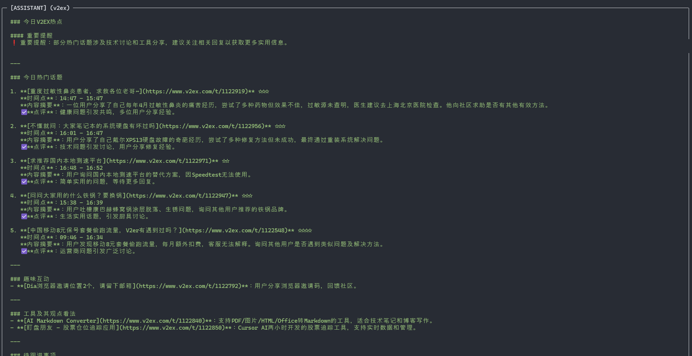

# mcp-server-v2ex

## Description
`mcp-server-v2ex` is an MCP server that wraps the V2EX API 2.0 for MCP-compatible agents and developer tools. It exposes structured operations for notifications, token management, member profile lookup, node browsing, topic retrieval, comment retrieval, and daily hot-topic summaries.

The project is designed as a reusable integration layer for general-purpose agents rather than a client-specific plugin, so it can be connected to Claude Desktop, Codex, and other tools that support the Model Context Protocol.

For Chinese documentation, see [README.zh-CN.md](./README.zh-CN.md).

## Available tools
- `notifications`: Fetch the latest notifications
- `delete_notifications`: Delete selected notifications
- `member_profile`: Get the profile of the user associated with the API token
- `token`: Inspect the current API token
- `create_token`: Create a new API token
- `nodes`: Get node information
- `node_topics`: List topics under a specific node
- `topic_detail`: Get the content of a topic
- `topic_comments`: Get replies for a topic
- `daily_summary`: Generate a summary of recent hot topics

## Installation
Install the package from npm:

```bash
npm install -g mcp-server-v2ex
```

## Configuration
First, create or retrieve a V2EX API token from [V2EX token settings](https://www.v2ex.com/settings/tokens).

Example MCP client configuration:

```json
{
  "v2ex": {
    "command": "%APP_DATA%\\Local\\nvm\\v22.14.0\\node.exe",
    "args": [
      "%APP_DATA%\\Local\\nvm\\v22.14.0\\node_modules\\mcp-server-v2ex\\dist\\index.js"
    ],
    "env": {
      "V2EX_API_KEY": "your-token-here",
      "NODE_TLS_REJECT_UNAUTHORIZED": "0"
    }
  }
}
```

`NODE_TLS_REJECT_UNAUTHORIZED=0` is only useful in special local networking setups, such as MITM proxy tooling. Do not enable it unless you understand the security tradeoff.

## Changelog
- `v0.1.1` / `2025-04-02`
  - Added daily hot-topic summaries
  - 
- `v0.1.0`
  - Initial feature-complete release

## Roadmap
- Improve daily hot-topic summarization for agent-driven workflows
- Expand documentation for broader MCP client integrations
